# A19:
## Referència web:
La referencia web que he utilitzat és la seguent:
´´´
    https://www.uv.mx/personal/gvera/2022/02/26/como-instalar-php-sobre-iis-10-en-windows-server-2019-datacenter/
´´´
## Com donar permisos per instalar executables al servidor:
Opcions de internet-Nivell personalitzat-Descarrega d'arxius i binaris
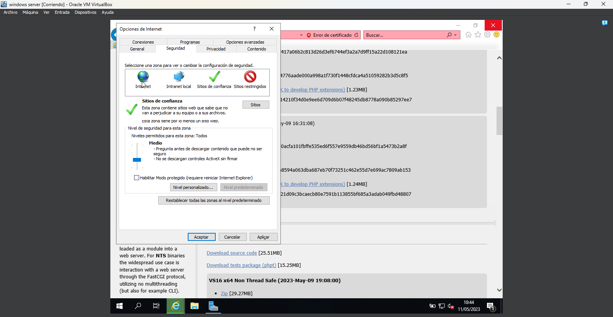
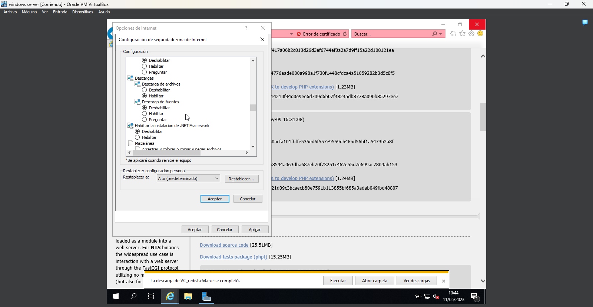
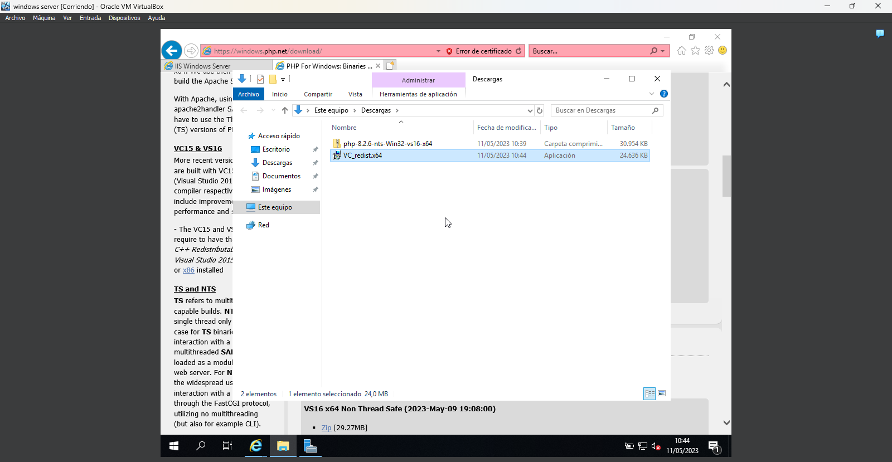

# Instal·lació de PHP sobre IIS 10 en Windows Server 2019
 
Comencem instalant els components i rols necessaris desde la pagina de configuració pròpia de windows server 2019:
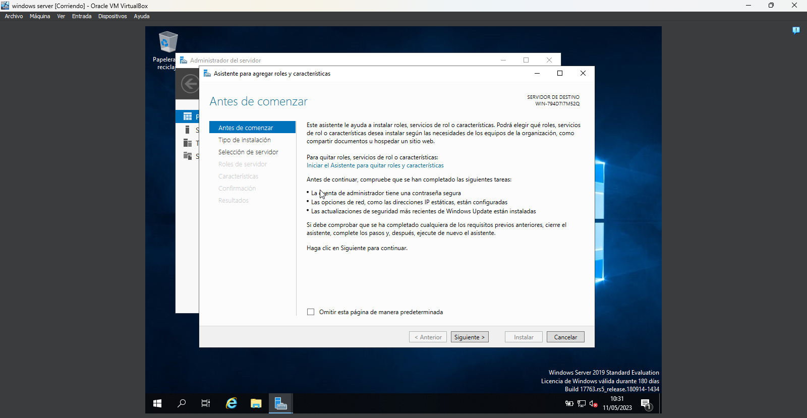

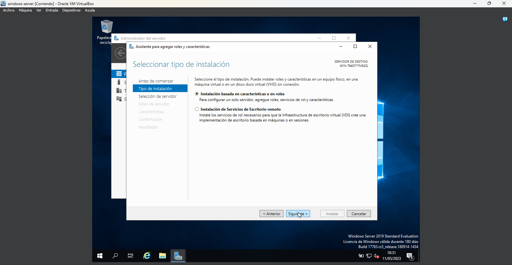

Seleccionem el nostre servidor:

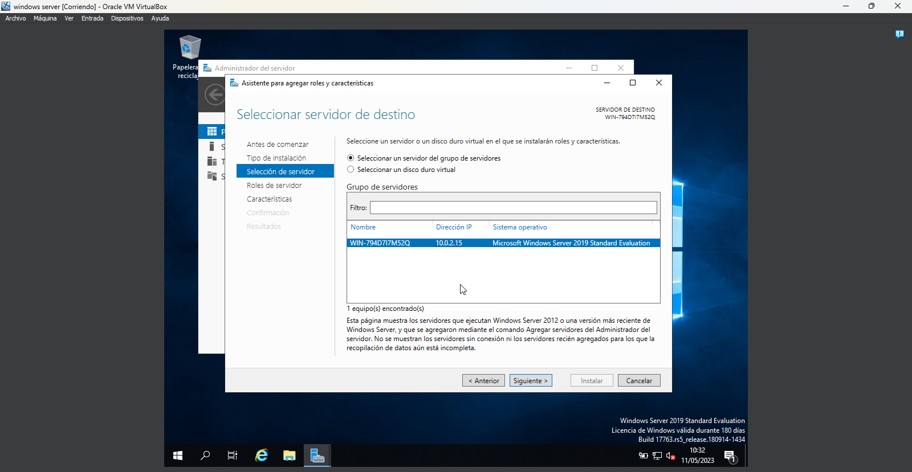

Seleccionem les IIS i agregem totes les característiques necessaries:
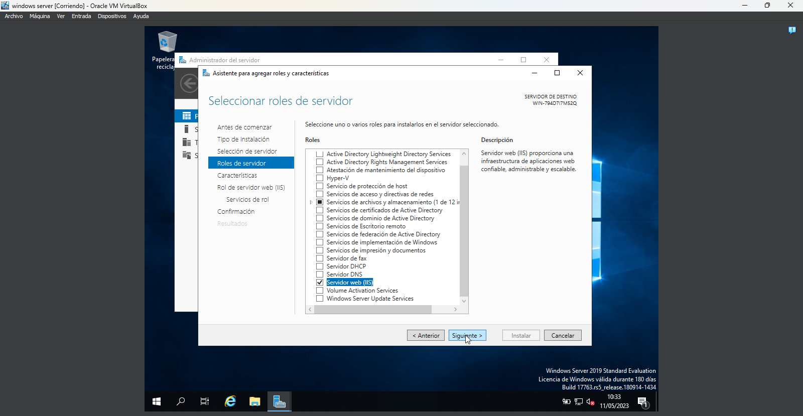

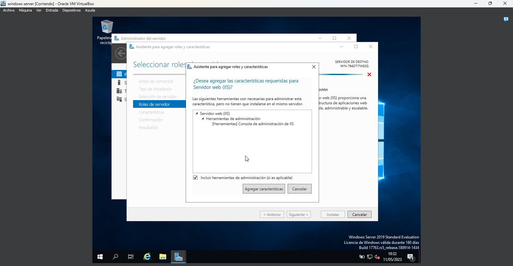

Seleccionem els rols que volem afegir:

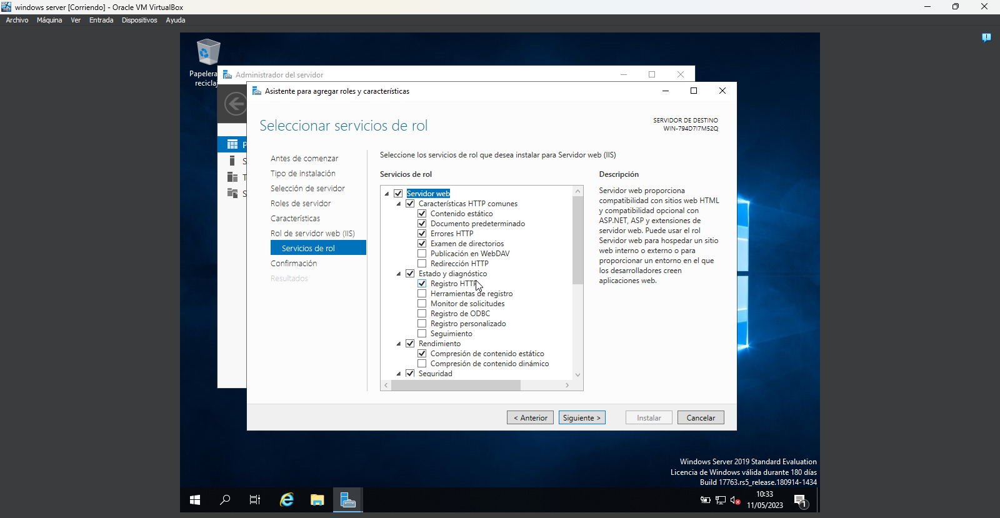

Confirmem la instalació i esperem a que el servidor ho instali tot:

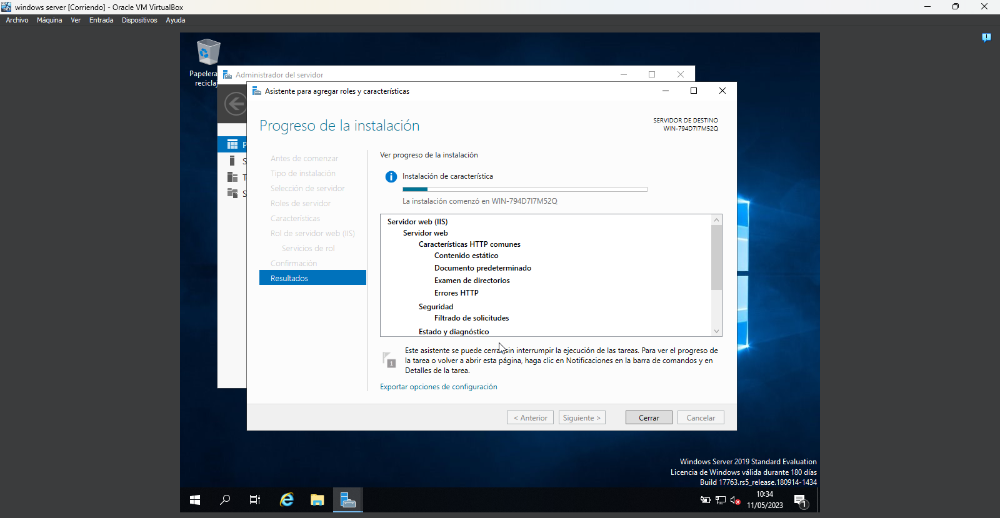

Amb això el que he instalat es el servidor web. Per accedir-hi ho hem de fer desde la seguent url:
```
http://localhost
```
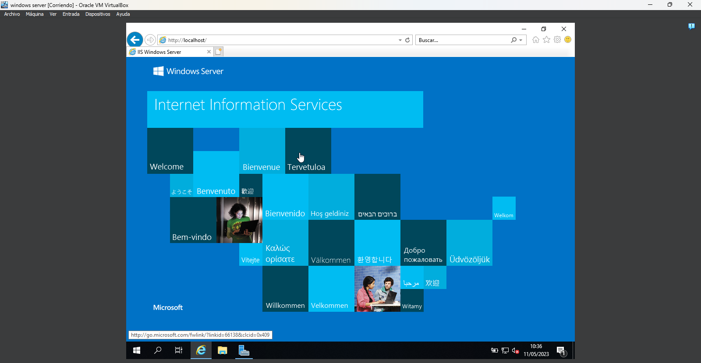

Ara hem de començar amb la instalació del servei de php en el nostre server. Per fer-ho hem de accedir al seguent url i descarregar el binari:
```
https://windows.php.net/download
```
(La versió que jo he instalat ha sigut la 8.2.6)
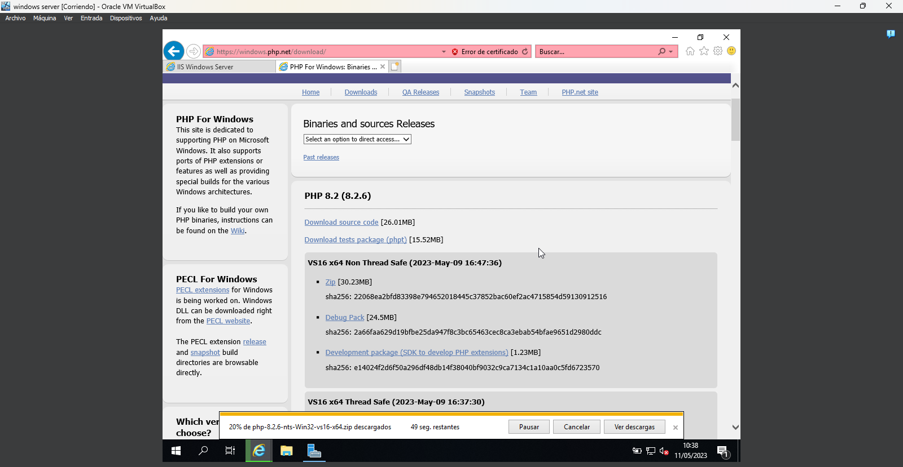

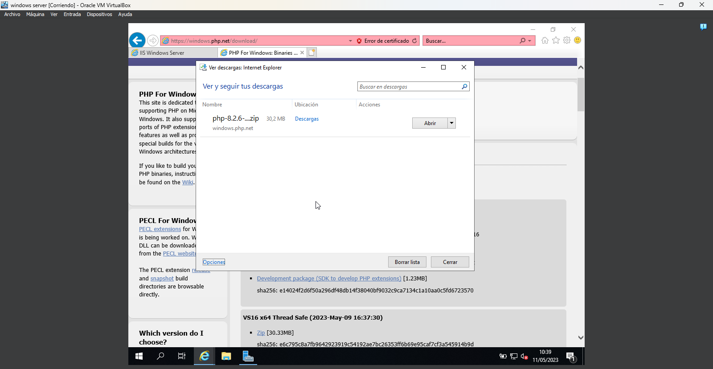

També hem de instalar el Visual C++ Redistributable for Visual Studio 2015-2019
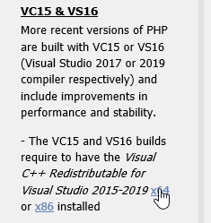

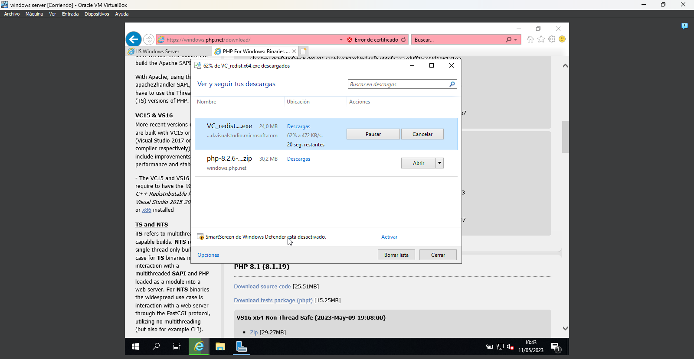

Ens dirigim a la carpeta a on s'hagin descarregat tots els arxius i descromprimim el zip del php en una carpeta. També li hem de canviar el nom per deixar-li només el nom de versió.:

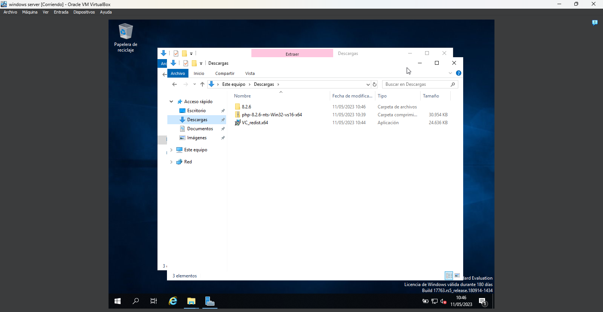

Ara anem a la ruta "c:\\Program Files" i creem una carpeta amb el nom de PHP:

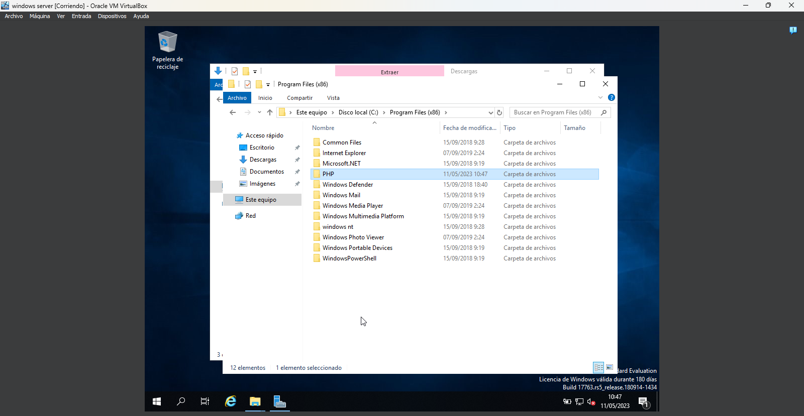

Modifiquem el fitxer php.ini:
´´´
extension_dir = "ext"
´´´
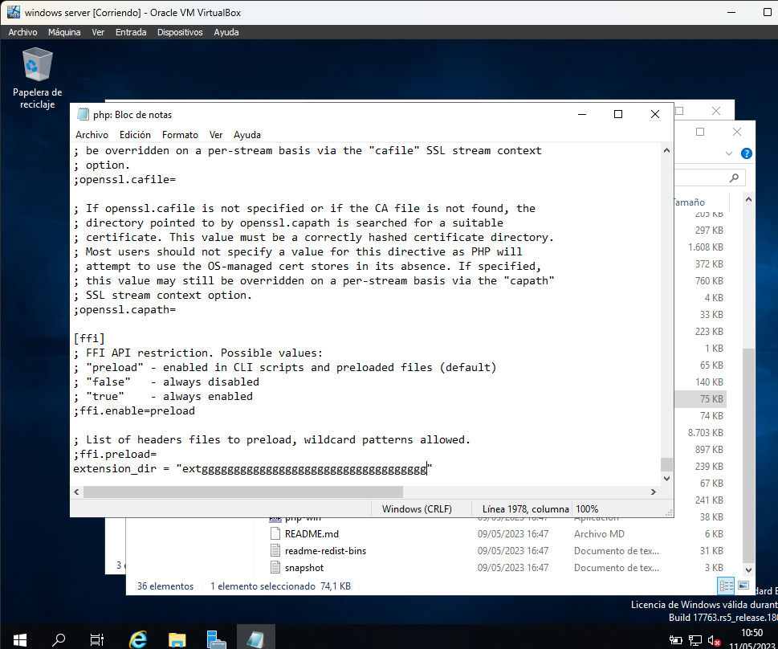

## Modificar la variable de entorn:

Hem de anar a configuració-propietats del sistema-variables de entorn.

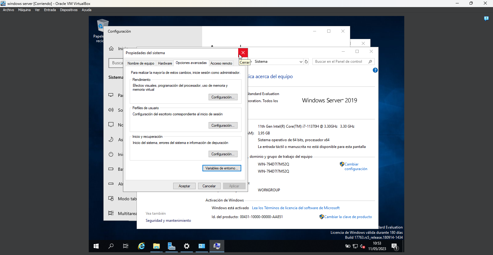

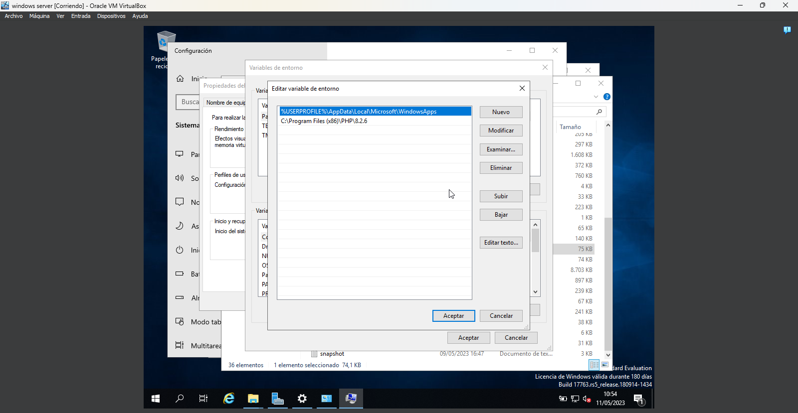

Creem un fitxer bat amb el nom de instala-php.bat i li afegim el seguent:
´´´
@echo off

REM Configuración de PHP en IIS

REM Descargar la compilación de PHP desde Web Platform Installer o el archivo zip desde http://windows.php.net/downloads/

REM Ruta SIN COMILLAS al directorio donde se ha descomprimido o instalado la carpeta de PHP
set phppath=C:\Program Files\PHP\v7.4

REM Ruta CON COMILLAS de PHP para concatenar variables string
set phppath2="%phppath%"

REM Limpiar los manejadores actuales de PHP
"C:\Windows\System32\inetsrv\appcmd" clear config /section:system.webServer/fastCGI
REM El siguiente comando generará un mensaje de error si PHP no está instalado. Esto puede ser ignorado.
"C:\Windows\System32\inetsrv\appcmd" set config /section:system.webServer/handlers /-[name='PHP_via_FastCGI']

REM Instalar el manejador de PHP
"C:\Windows\System32\inetsrv\appcmd" set config /section:system.webServer/fastCGI /+[fullPath='%phppath2%\php-cgi.exe']
"C:\Windows\System32\inetsrv\appcmd" set config /section:system.webServer/handlers /+[name='PHP_via_FastCGI',path='*.php',verb='*',modules='FastCgiModule',scriptProcessor='%phppath2%\php-cgi.exe',resourceType='Unspecified']
"C:\Windows\System32\inetsrv\appcmd" set config /section:system.webServer/handlers /accessPolicy:Read,Script

REM Configurar las variables de FastCGI
"C:\Windows\System32\inetsrv\appcmd" set config -section:system.webServer/fastCgi /[fullPath='%phppath2%\php-cgi.exe'].monitorChangesTo:php.ini
"C:\Windows\System32\inetsrv\appcmd" set config -section:system.webServer/fastCgi /[fullPath='%phppath2%\php-cgi.exe'].activityTimeout:600
"C:\Windows\System32\inetsrv\appcmd" set config -section:system.webServer/fastCgi /[fullPath='%phppath2%\php-cgi.exe'].requestTimeout:600
"C:\Windows\System32\inetsrv\appcmd" set config -section:system.webServer/fastCgi /[fullPath='%phppath2%\php-cgi.exe'].instanceMaxRequests:10000
"C:\Windows\System32\inetsrv\appcmd".exe set config -section:system.webServer/fastCgi /+"[fullPath='%phppath%\php-cgi.exe'].environmentVariables.[name='PHP_FCGI_MAX_REQUESTS',value='10000']"
"C:\Windows\System32\inetsrv\appcmd".exe set config -section:system.webServer/fastCgi /+"[fullPath='%phppath%\php-cgi.exe'].environmentVariables.[name='PHPRC',value='%phppath%\php.ini']"

REM Agrega index.php como documento default
"C:\Windows\System32\inetsrv\appcmd" set config /section:defaultDocument /-files.[value='index.php']
"C:\Windows\System32\inetsrv\appcmd" set config /section:defaultDocument /+files.[value='index.php']
´´´
Ens hem de assegurar de que en el fitxer a la variable setphppath li posem la ruta de la nostre carpeta.
´´´
set phppath=C:\Program Files\PHP\8.2.6
´´´
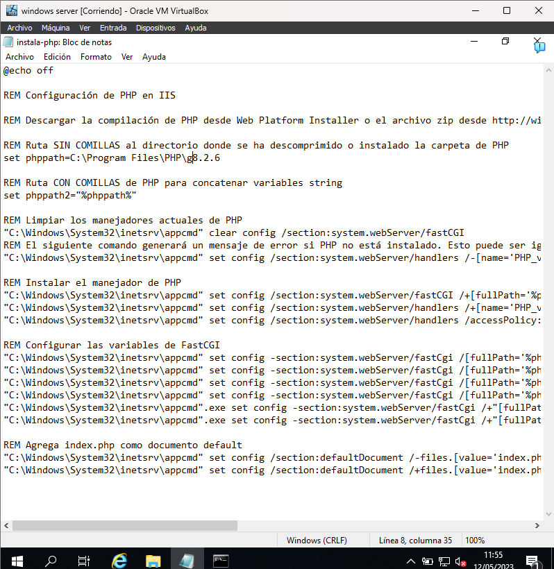

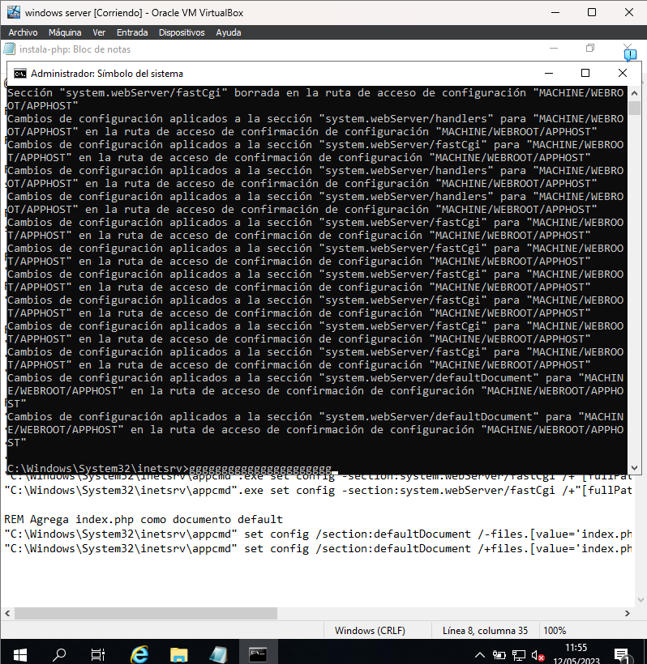

A la ruta c:\inetpub\wwwroot li afegimel fitxer info.php:

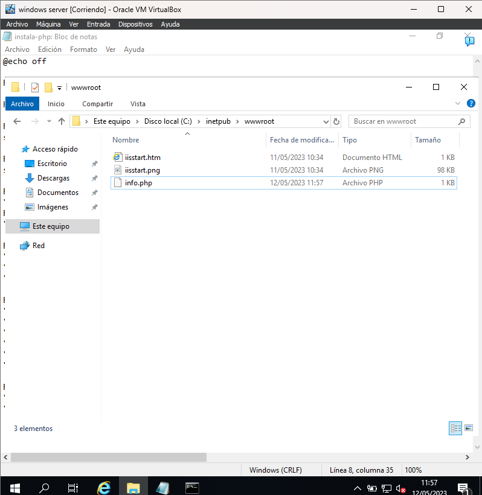

